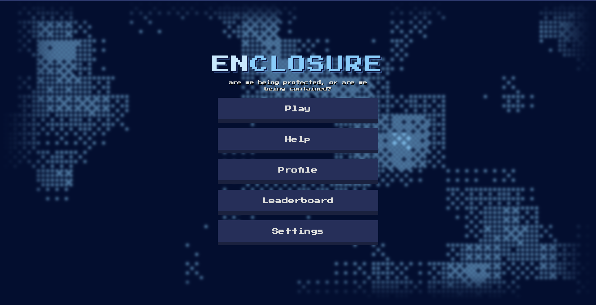

# Enclosure

> Are we being protected, or are we being contained?

A pixel puzzle game about walls and containment. Place four walls on a board so blue orbs stay enclosed and red cones stay free.

## How to play

1. Drag walls onto board indents (or select a wall and use the number keys).
2. Surround every **blue orb** on all sides.
3. Leave every **red cone** with an opening — never fully enclose them.
4. Place all four walls correctly to clear the sector.

Play as a guest, or create an account to keep progress in the cloud. A short tutorial runs on first play; Help covers controls and rules anytime.

## Acknowledgments

Inspired by the board game *Rider–Bravest Knights* (Zetzeka). Enclosure is an independent fan project and is not affiliated with or endorsed by the rights holders.
